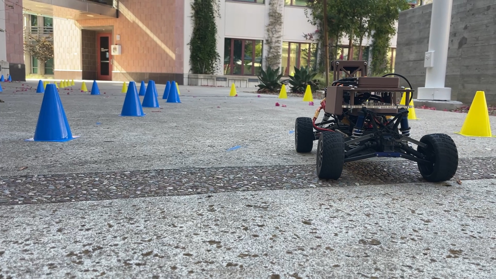

# Cone-Defined Corridor Navigation



MAE 148 final project — a car that drives itself through a course marked out by
traffic cones, where the cones are not obstacles to dodge but the thing that
tells the car where the road is. Everything in front of it in that photo is the
road; the blue and yellow cones are its two edges.

The car detects five cone classes with a YOLOv8n detector (**test mAP50-95
0.715**), fuses those labels with LD06 lidar clusters into a labelled cone list,
pairs the cones into a corridor and extracts a centreline, follows it with pure
pursuit, recognises a junction from a triple of red cones and turns where a
route file — **or its own search** — tells it to, and stops in front of a
magenta trophy.

The original proposal scoped autonomous route planning as a nice-to-have and
the provided route as the baseline. Both were built, and both were driven.

## The team

| | |
|---|---|
| Richard Thatcher | MAE |
| Max Tsai | MAE |
| Eli Carsenti | ECE |

The commit history is not a measure of who did what. Building the track,
surveying it, driving the car, reading a tape and adjusting a servo by hand
leave no trace in git, and they are most of what this project consisted of —
see [`docs/ai-usage.md`](docs/ai-usage.md).

---

## What the car did, on the car

Each claim below is a log in `data/trials/`, not a description. Read any of them
with `python model/capture/junction_report.py <log>`.

### A full provided route, ending at the goal — `goal-run-1551.jsonl`

586 ticks / 58.5 s at 10 Hz. LEFT at the first junction (gate seen at 2.77 m),
RIGHT at the second, route fully consumed, then the trophy: run-in opened at
0.99 m and the car **stopped 0.265 m away** with `stop_reason: goal reached`.
Zero goal hops, zero blind ticks, duty held at 0.050.

### Two junctions from a provided route — `junction-two.jsonl`

<video src="https://github.com/user-attachments/assets/31430fbf-ba58-4b5e-878e-98231733a4e8" poster="docs/media/junction-two-poster.jpg" controls></video>

344 ticks / 34.3 s. The route asked for two junctions, `left` then `right`, and
the car took both: entered the manoeuvre twice, confirmed both passes, with 40
ticks holding a whole red triple and the first gate picked up at 2.82 m.

The same run from the car's side — cone labels, the lidar scan, and the
extracted centreline in green, in Foxglove:

<video src="https://github.com/user-attachments/assets/bc84a101-1069-4fd1-b3a1-fa228fb6d274" poster="docs/media/fusion-poster.jpg" controls></video>

This is the fusion output the whole stack rests on: LD06 clusters carrying
camera class labels, paired into corridor boundaries, with the centreline pure
pursuit actually steers to. The two recordings were taken simultaneously, so
the cones appearing in the 3D view are the ones in the footage above.

### A full autonomous exploring run — `explore-run-1854.jsonl`

<video src="https://github.com/user-attachments/assets/367e3be7-fe15-49c6-ada4-b59914b98a03" poster="docs/media/explore-run-poster.jpg" controls></video>

*The full 63-second run. The operator walks alongside holding the deadman —
releasing it stops the car — and carries it back when it names a dead end,
which is what stage 7b requires. If the player does not load, the same file is
on the [`video-v1` Release](https://github.com/SquilliamFancysun/cone-corridor-nav/releases/tag/video-v1).*

868 ticks / 86.6 s, in failing evening light. The car chose RIGHT at the
junction, drove into a dead end and **named it itself** at 30.3 s — *"corridor
ends 0.85 m ahead (orange wall seen)"* — was carried back and re-armed, took the
LEFT branch instead, and **stopped 0.215 m from the trophy**. It built a map of
3 nodes / 2 edges / 1 dead end as it went and emitted the route it had worked
out to `data/routes/optimal_explore_1854.txt`.

That route file is the interesting artefact: the car drove two gates while
exploring and the emitted route is one, because it removed the dead end. It is
also one turn short of describing the whole course — the car physically passed a
second junction that never armed a gate, so the route is correct for what was
*mapped*, which is not the same as what was driven. The file says so in its own
header.

### The reverse drivetrain — `rev-8a.jsonl`, `rev-8b-run{1,2,3}-*.jsonl`

`rev-8a` on a stand answered the only question that mattered: the VESC accepts a
negative duty from this tool and the wheels turn backwards at 0.05. Three
tape-measured floor runs (105 in / 118 in / 115 in) then settled the reverse
speed at **0.423 m/s, sd 0.014** — measured tape-over-clock and so independent
of the odometry, which under-reads the reverse by 12–28%.

The first floor run also found a fault that had nothing to do with reverse: the
car backed 120 in and arrived 40 in to the right, an arc of 5.08 m radius with
the servo commanded to dead centre on all 291 ticks — a **3.72° mechanical bias
at commanded centre**. The steering was adjusted by hand before the next run,
and median per-tick lateral error fell from 0.0395 m to 0.0075 m.

---

## What does not work

This section is part of the deliverable. The repo would read better without it
and would be worth less.

- **The autonomous back-out manoeuvre has never run on a car.** `backout.py` and
  `reverse_ctrl.py` are written and pass in simulation, and `backout_state` is
  empty on all 12,873 ticks of all 26 trial logs. Stages 8c–8f of
  [`docs/junction-bringup.md`](docs/junction-bringup.md) were not run.
- **The sim result is weaker than it looks.** The blocked-maze test reaches the
  goal on both mirrors at `--lookahead 1.5`. At `--lookahead 0.8`, which
  [`docs/hardware-baseline.md`](docs/hardware-baseline.md) mandates for this
  car, the right-blocked mirror fails: *"backed out 5.29 m without seeing the
  junction (bound 5.26 m)"*.
- **The reverse is out of envelope.** 0.423 m/s is 1.41× `reverse_ctrl.MAX_REVERSE_MPS`,
  above the speed `K_HEADING`/`K_CROSS` were swept at — and no duty can bring it
  down, because 0.05 is already the motor's cogging floor.
- **The distance bound is longer than the code believes.** `BackoutManoeuvre`
  bounds on travelled distance, and the odometry under-reads by 12–28% (mean 21,
  sd 10 points — not a scale factor), so the car would run 14–39% past its own
  bound in the one direction it cannot see.
- **No OAK-D `.blob`.** `model/export/` is empty; the detector runs in PyTorch
  on the Pi rather than on the camera's VPU.
- **D5 is unfilled.** `data/layouts/track_v1.csv` has a header and no measured
  rows, so `analysis/map_from_log.py --layout` has never scored the built map
  against surveyed ground truth. The map residual is known only in simulation.
- **The junction was never laid to spec.** `data/layouts/junction_v2.md` calls
  for 1.35 m gate gaps; the driven runs measured 0.71–0.92 m. The car detected
  the gates anyway, and `junction_report.py` prints the discrepancy on every run.
- **Three known sim test failures** (`pytest sim`), all in `test_drive_sim.py`.

---

## Generative AI use

**This repository was written with Claude Code.** That was a deliberate
methodology choice made at the start of the project, not incidental assistance
at the end of it.

**113 of the 117 commits (96.6%) carry a `Co-Authored-By: Claude` trailer**,
including the very first commit in the repository. Reproduce that count with:

```bash
git log --format='%(trailers:key=Co-authored-by,valueonly)' | grep -c Claude
```

The four that do not are Eli Carsenti's mp3 playback feature. (Counts are as
of this commit; the command above is the authority as the history grows.) Every other line
of the 26,704 lines of Python and 710 tests here was written in collaboration
with an AI coding agent.

What the humans did is not code: 43 cones laid to a surveyed layout, a tape
measure, a servo adjusted by hand, ~150 hand-drawn bounding boxes and the
corrections over four model-prelabeled sessions — and roughly a dozen recorded
instances of overruling the model on evidence it could not see.

[**`docs/ai-usage.md`**](docs/ai-usage.md) is the full log (deliverable D11):
the per-phase table, the human corrections, and three worked examples with the
prompt, what came back, and what changed.

---

## Repository layout

```
model/capture/   THE ON-CAR RUNTIME. drive_junction.py is the program that
                 drives the car; drive_corridor.py is the corridor-only
                 subset it extends. Also the dataset recorder, the live
                 views, the lidar driver, and junction_report.py.
src/             Pure algorithm packages — no ROS, no hardware, no I/O.
  cone_perception/   clustering, fusion, label memory, odometry, ego-motion
  cone_nav/          corridor/ topology/ guidance/ control/
  cone_msgs/msg/     the labelled-cone schema; LabeledCone.msg is the
                     source of truth for class order
model/           CV model development (off-car): dataset, labelling,
                 training runs and curves
sim/             Synthetic cone-field generator + replay harness
analysis/        map_from_log.py — rebuild the map from a trial log and
                 score it against a surveyed layout
data/            layouts (ground truth), routes, and 26 on-car trial logs
docs/            bring-up manual, hardware baseline, data collection, D11
```

Deliverables: `model/` → D1–D2, `analysis/` → D3 + D6, `model/capture/` +
`src/` → D4, `data/layouts/` → D5, `docs/` → D7 + D11.

**Start here:** [`docs/junction-bringup.md`](docs/junction-bringup.md) is the
operating manual — the staged bring-up from a desk test to a driven run, with
what each stage did and the numbers it produced.

## Design rule that everything depends on

**Algorithm code never imports `rclpy`.** Corridor extraction, cone pairing, the
gate state machine, graph code, planners, and pure pursuit are plain Python
modules under `src/`. This is what lets:

- everything be developed and unit-tested on a laptop with no ROS installed
- `pytest` run on any machine with no install step at all — `conftest.py` puts
  the packages on the path
- the replay harness feed recorded logs through the exact code that ran on-car

The rule held. No file in this repository imports `rclpy`.

The packages were originally shaped as ROS 2 ament packages against a
container-based deployment. That was abandoned: the car runs the tool as a host
process, `deploy.sh` rsyncs the pure packages next to it, and the ROS node
wrappers were never built. The packaging was removed rather than left as a
costume — see [`docs/ai-usage.md`](docs/ai-usage.md) for why the pure/wrapper
split survived the change anyway.

## Running it

### At a desk, no hardware

```bash
python -m pytest                # 741 passed, 2 skipped
python -m pytest sim            # 76 passed, 3 known failures

# replay a track through the real navigation code
PYTHONPATH=src:model/capture:. \
  python -m sim.drive_sim --track junction-left --route data/routes/junction_left.txt

# rebuild the map the car built, from its log
python analysis/map_from_log.py data/trials/explore-run-1854.jsonl

# read any run the way we read them during bring-up
python model/capture/junction_report.py data/trials/goal-run-1551.jsonl
```

### On the car

Three flags were not optional on this vehicle, and each cost a track session to
learn:

```
--invert-steering    the servo is mirrored; without it the car turns the wrong
                     way and accumulates -167 deg over a run
--max-range 3.5      the flattened camera pitch admits world clutter past 2.5 m
--lookahead 0.8      at the shipped 1.0 the car clipped the centre red cone
```

```bash
./model/capture/deploy.sh                     # commit, push, THEN deploy

# drive a provided route
python drive_junction.py --weights ~/models/best.pt --route routes/route_v1.txt \
    --invert-steering --max-range 3.5 --lookahead 0.8 --max-duty 0.05 --log run.jsonl

# explore, and write out the route it discovers
python drive_junction.py --weights ~/models/best.pt --explore \
    --invert-steering --max-range 3.5 --lookahead 0.8 \
    --max-duty 0.05 --emit-route routes/optimal.txt --log explore.jsonl
```

Hold X on the F710 to arm; releasing it stops the car. `--dry-run` runs the full
perception and decision stack with the VESC never opened.

## Hardware

Car `ucsdrobocar-148-02`. Verified baseline, port map, cabling traps and the
device checks are in [`docs/hardware-baseline.md`](docs/hardware-baseline.md).

| | | |
|---|---|---|
| Compute | Raspberry Pi 5 Model B | aarch64, kernel 6.12.96 |
| Camera | OAK-D Lite | IMX214 RGB, USB3 direct to the Pi |
| Lidar | LD06 | `/dev/ttyUSB0`, 9.97 Hz, via powered hub |
| Drive | VESC | `/dev/ttyACM0` |
| Input | Logitech F710 | `/dev/input/js0`, XInput mode |
| Power | CKCS CK2416 DC-DC | 5 V rail to the hub, measured 5.04 V |

Geometry: wheelbase 0.3302 m, lidar scan plane at 0.127 m mounted at the front
edge of the chassis. The chassis occludes the rear 142° of the lidar, leaving a
usable forward arc of ~218° — measured, not assumed.

## What is deliberately NOT in git

- **Dataset images** (`model/dataset/images/`) — large binaries. The labels,
  splits and dataset card ARE in git; see `model/README.md`.
- **Model weights** (`*.pt`, `*.onnx`, `*.blob`) — on GitHub Releases
  (`weights-v3`). Training configs and curves ARE in git.
- **Driving audio** (`model/capture/audio/`) — 7 MB of mp3 on the `audio-v1`
  Release; `deploy.sh` fetches it onto the car. The code that plays it IS in git.
- **Rosbags** (`*.db3`, `*.mcap`) — trial logs and analysis outputs ARE in git.
- **Demo video** — 720p H.264 on the `video-v1` Release, and uploaded as GitHub
  attachments for the inline players above. The still frames used as poster
  images ARE in git, at `docs/media/`.

Tags worth knowing: `demo-v1` pins the code and weights of the goal run,
`weights-v3` the deployed detector, and 14 `deploy/*` tags pin exactly what was
on the car for each session.
