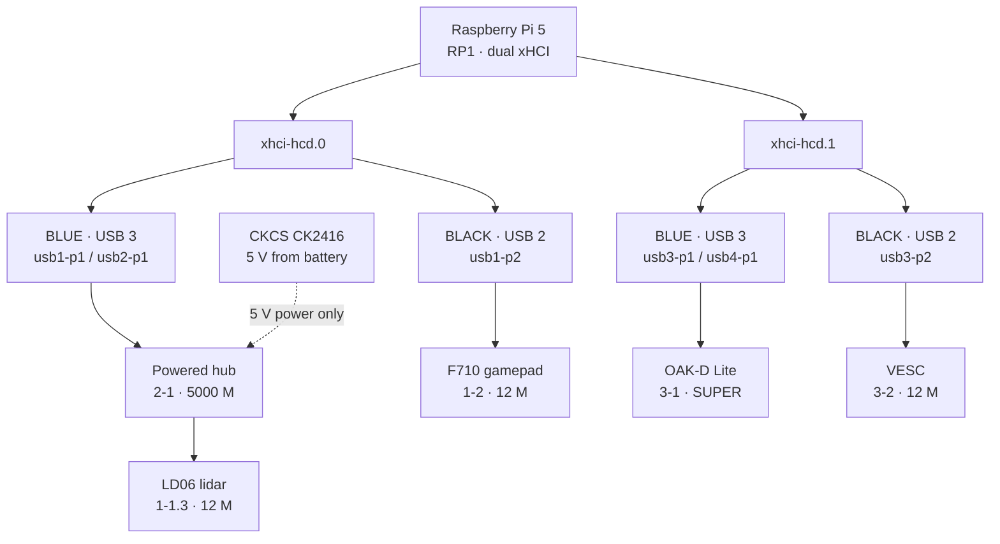

# Cone Car Hardware Baseline

_The verified USB configuration for `ucsdrobocar-148-02`. Every device, the port it
belongs in, the cable it requires, and how to prove the whole thing still works
before a data run. Re-run the [verification procedure](#re-verification) after any
change to cabling, ports, or power._

**Verified 2026-08-26** — Raspberry Pi 5 Model B Rev 1.0, kernel `6.12.96+rpt-rpi-2712`, aarch64.

## Status at last verification

| Device | Result |
|---|---|
| OAK-D Lite | `SUPER` (5 Gbps), cameras RGB/LEFT/RIGHT |
| LD06 lidar | 9.97 Hz rotation, 407 frames/s, 19.1 KB/s |
| VESC | `/dev/ttyACM0`, ChibiOS/RT VCP, 12 M |
| F710 | `/dev/input/js0`, XInput mode, `xpad` |
| 5 V rail | `EXT5V = 5.04 V`, `throttled=0x0`, 44.4 °C |

Readings taken at idle on a fresh boot. The rail figure still needs confirming
under real load — see step 4 of the procedure.

## Topology

The Pi 5 runs two xHCI controllers. Each drives **one blue USB 3 connector and one
black USB 2 connector**: a blue port's 2.0 lane appears on the 480 M root hub and
its SuperSpeed lane on the 5000 M root hub. This is why a blue port running at
USB 2.0 is indistinguishable from a black port in `lsusb` output, and why this map
is worth writing down.



**Why this assignment.** Both blue ports go to the only two things that can use
them: the OAK-D, which needs SuperSpeed for 1080p, and the hub, whose uplink
carries everything behind it. Both black ports hold devices hard-capped at
12 Mbps by their own silicon. One Pi port stays free as a spare.

## Device inventory

| Device | USB ID | Bus path | Connector | Link | Node |
|---|---|---|---|---|---|
| OAK-D Lite | `03e7:2485` → `03e7:f63b` booted | `3-1` | Blue, direct | SUPER 5 G | DepthAI |
| LD06 lidar (CP2102) | `10c4:ea60` | `1-1.3` | Via hub | 12 M | `/dev/ttyUSB0` |
| VESC (ChibiOS/RT VCP) | `0483:5740` | `3-2` | Black, direct | 12 M | `/dev/ttyACM0` |
| Logitech F710 | `046d:c21f` | `1-2` | Black, direct | 12 M | `/dev/input/js0` |
| Powered hub (Genesys) | `05e3:0610` / `05e3:0626` | `1-1` / `2-1` | Blue, direct | 5000 M | — |

OAK-D MxID: `184430103126A01200`.

### Stable device paths

Adding or moving anything on the bus renumbers `ttyUSB0` and `ttyACM0` — they are
positional. Configuration should reference the by-id paths, which are tied to the
device rather than to enumeration order:

```
# VESC
/dev/serial/by-id/usb-STMicroelectronics_ChibiOS_RT_Virtual_COM_Port_304-if00

# LD06 lidar
/dev/serial/by-id/usb-Silicon_Labs_CP2102_USB_to_UART_Bridge_Controller_0001-if00-port0
```

The lidar's serial is `0001`, the generic Silicon Labs default. Add a second
CP2102 device to this car and the by-id names collide; at that point switch to a
udev rule keyed on the physical port path.

## Cable requirements

Two separate cable failures cost most of a day on this build. Both were invisible
— the hardware powered up and lit its LEDs in each case. Treat cables as a
diagnosis of first resort.

| Link | Required cable | Why |
|---|---|---|
| Pi → OAK-D | USB-C to A, USB 3.0 / 3.2 Gen 1+ | SuperSpeed needs four conductors beyond the USB 2.0 pair. A 2.0 cable links at 480 M and nothing in `lsusb` says why. Keep it ≤ 1 m. |
| Hub → lidar | Micro-B to A, data-capable | Charge-only micro-USB cables power the board, spin the motor and blink both LEDs while carrying no data. USB 2.0 is fine — the CP2102 caps at 12 Mbps. |
| Pi → VESC | Any data cable | USB 1.1 full-speed device; reports 12 M in any port with any cable. Do not spend a blue port on it. |
| Pi → hub uplink | USB 3.0 | Only matters if a SuperSpeed device ever moves behind the hub. Currently carries 0.15 Mbps. |

To test a suspect cable: plug it into a laptop with a phone or USB stick on the
far end. If the device mounts, the data lines work. If it only charges, label it
and get it away from the car.

## Power

The Pi 5 sets a hardware current limit on its USB-A ports from what the supply
advertises over USB-C PD. Without a confirmed 5 A supply that limit is **600 mA
total across all four ports**, enforced by a load switch that cuts port power when
tripped.

| Rail | Source | Feeds |
|---|---|---|
| Pi 5 V | Class DC-DC | Pi core, OAK-D, VESC, F710, hub uplink |
| Hub 5 V | CKCS CK2416, from battery | Powered hub, LD06 lidar |

Moving the lidar onto its own rail takes its ~180 mA motor draw off the Pi's
budget entirely, and decouples the OAK-D's current spikes from the Pi's core
voltage — a sag deep enough to brown out the Pi risks SD corruption mid-run.

**Still open:** `usb_max_current_enable=0` with no override in `config.txt`, so the
600 mA cap is active. Present load fits under it, but the OAK-D draws more now
that it negotiates SuperSpeed. If dropouts appear under load, set
`usb_max_current_enable=1` in `/boot/firmware/config.txt` — **only** on a supply
that genuinely delivers 5 A. On a weaker one that flag converts a clean port trip
into a Pi-wide brownout.

## Re-verification

Bus presence is not function. Each check below covers something that has actually
failed on this car at least once.

### 1. Topology and nodes

```bash
lsusb -t                    # expect hub on 5000M, four devices
ls -l /dev/serial/by-id/    # expect CP2102 + ChibiOS
ls /dev/input/js0
```

### 2. Camera link speed

Idle `lsusb` shows the OAK-D at 480 M and that is correct — at rest it is the
MyriadX ROM bootloader, which is USB 2.0-only by design. It negotiates SuperSpeed
only after DepthAI loads firmware, so this is the sole valid check:

```bash
~/env/bin/python -c "import depthai as dai; d=dai.Device(); \
print(d.getUsbSpeed().name, d.getConnectedCameras())"

# expect: SUPER [<RGB>, <LEFT>, <RIGHT>]
```

### 3. Lidar is streaming, not just enumerated

Read the port directly and decode the LD06 frame header. Healthy baseline:
~19 KB/s, ~400 frames/s, rotation 9.9–10.1 Hz, packets starting `54 2c`.

```python
import serial, time
s = serial.Serial("/dev/serial/by-id/usb-Silicon_Labs_CP2102_USB_to_UART_Bridge_Controller_0001-if00-port0",
                  230400, timeout=1)
time.sleep(0.3); s.reset_input_buffer()
t0 = time.time(); buf = bytearray()
while time.time() - t0 < 3.0:
    buf += s.read(4096)
hdr = sum(1 for i in range(len(buf)-1) if buf[i] == 0x54 and buf[i+1] == 0x2C)
i = buf.find(b"\x54\x2c")
spd = int.from_bytes(buf[i+2:i+4], "little")
print(int(len(buf)/3.0), "B/s", round(hdr/3.0, 1), "frames/s", round(spd/360, 2), "Hz")
```

### 4. Power under real load

Idle readings prove nothing. Run a full capture with the car driving, then check:

```bash
vcgencmd get_throttled       # bit 16 latches undervolt since boot
vcgencmd pmic_read_adc | grep EXT5V

# pass: EXT5V_V above ~4.8 V, throttled=0x0
```

## Field notes — traps that cost time

**A powered, spinning lidar proves nothing.** The LD06 showed a red power LED, a
flashing green signal LED and a spinning motor while the Pi saw no device at all.
The adapter draws VBUS from the same cable that carries data, so a charge-only
cable lights everything up and enumerates nothing. _Tell:_ no usb-serial module in
`lsmod` means the kernel never saw an attach — that is physical, never
configuration.

**Blue ports are invisible in `lsusb`.** A blue port running at USB 2.0 appears on
the same 480 M root hub as a black one, so port position alone cannot tell you
whether a device is where you think it is. _Tell:_ watch the 5000 M root hubs — a
device on `usb2` or `usb4` is the only proof a connector is blue.

**The camera reports USB 2.0 when idle.** Unbooted, the OAK-D is `03e7:2485`, the
MyriadX ROM bootloader — `bcdUSB 2.00` and incapable of SuperSpeed regardless of
cable or port. _Tell:_ never diagnose the camera's link from `lsusb`; boot it and
read `getUsbSpeed()`.

**The F710 renumbers its buttons.** The pad enumerates as `046d:c22f` (RumblePad,
D mode) and re-enumerates as `046d:c21f` (XInput, X mode) a few seconds into boot.
Button indices differ between switch positions. _Tell:_ run
`joystick.py --probe-buttons` with the switch where you will actually drive.

**Deploy stamps the commit by hand.** The car has no git clone, so `deploy.sh`
writes `HEAD` into `VERSION` and `capture_cones.py` copies that into every
`session.json`. Amend or rebase after deploying and the recorded commit becomes
unreachable — provenance silently breaks. _Rule:_ commit everything, including the
track spec, **then** deploy, **then** capture.

**The lidar sees the car.** Returns at ~250 mm around 184° are the chassis, not an
obstacle. This is what `LIDAR_LOWER_LIMIT = 90` / `LIDAR_UPPER_LIMIT = 270` exist
to mask. _Tell:_ confirm the masked arc matches your actual mount before trusting
scan geometry.

## Software on the car

| Component | Location | Notes |
|---|---|---|
| Python env | `~/env` | depthai 2.21.2.0, cv2 4.9.0, donkeycar |
| Capture tool | `~/cone_capture_tool/` | Pushed by `deploy.sh`; commit stamped in `VERSION` |
| Drive config | `~/mycar/myconfig_capture.py` | `CAMERA_TYPE="MOCK"` so DonkeyCar releases the OAK-D |
| Sessions | `~/cone_capture/` | 28 G free, ~200 MB per 4-minute session |
| ROS 2 | container `robocar_team2` | Class container; not required for dataset capture |

**Camera ownership.** Only one process can hold the OAK-D. During capture
DonkeyCar runs as the drive-by-wire stack only — it reads the F710 and drives the
VESC with a mock camera — while `capture_cones.py` owns the real device. Both read
`/dev/input/js0` simultaneously, which joydev handles by giving each open file its
own event stream. See [`model/capture/README.md`](../model/capture/README.md).
