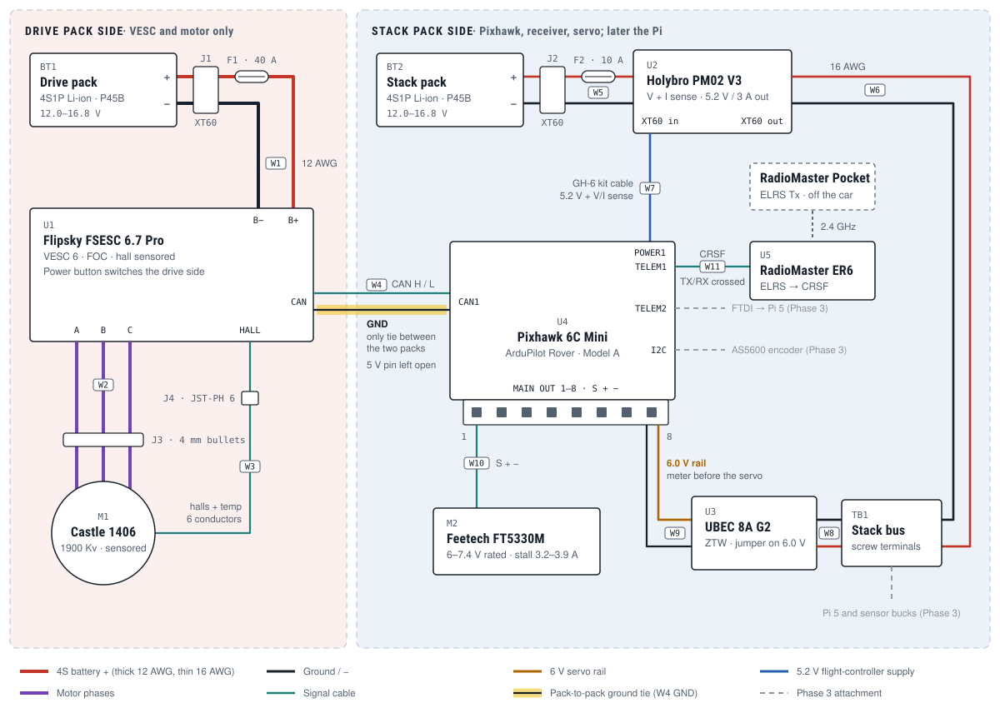

# Robocar v2 Harness

_How v2 is wired, phase by phase. Each phase's parts come from the Robocar v2 BOM
(a Claude Docs page outside the repo); this file is the record of how they connect.
Update the wire list as the harness is built, and log every measured value below._

**Status:** Phase 2 drawn 2026-10-07, not yet built.

## Phase 2: radio-controlled car

Phase 2 is everything needed to drive under the transmitter, before the Pi or any
autonomy code. Steering and throttle go through the Pixhawk: the ER6 feeds it CRSF,
it drives the servo from MAIN OUT 1 and the VESC over DroneCAN.

Two packs and one ground tie. The drive pack feeds only the VESC and motor. The stack
pack feeds the Pixhawk (through the PM02), the ER6 (from TELEM1) and the 6 V servo
rail (through the UBEC). The ground in the CAN cable (W4) is the single conductor
joining the two sides.

### Rules the harness depends on

- **One ground tie.** Servo, ER6 and Pixhawk all return to the stack pack. Power
  nothing from the VESC's 5 V, and add no second ground path between the sides.
- **Three CAN conductors, not four.** Run CAN H, CAN L and GND, with H and L twisted.
  Leave the 5 V pin open. With both packs off, CAN H to CAN L should read about 60 Ω;
  at about 120 Ω, add one 120 Ω resistor.
- **Check 6.0 V before the servo goes on.** The Pixhawk does not regulate its servo
  rail; whatever the UBEC makes goes straight to the servo. Its output select also
  offers 5.0 and 7.4 V. The rail tolerates 0–36 V; the FT5330M is rated 6–7.4 V.
- **Fuse at the packs.** F1 (40 A) and F2 (10 A) sit right after each pack connector.
  Keep the VESC battery current limit at 30 A or less so F1 only opens on a fault.
- **Retain the friction-fit plugs.** MAIN OUT is a plain 2.54 mm header. W9 and W10
  are the only push-on joints in the harness, so hold them with the printed retainer.

### Wire list

| Wire | From → to | Conductors | Connectors | Gauge | Notes |
|---|---|---|---|---|---|
| W1 | BT1 drive pack → U1 VESC battery | + − | Pack XT60 → J1 XT60 → F1 inline blade holder → soldered to FSESC bare leads | 12 AWG | F1 40 A in the + leg, a few cm from J1 |
| W2 | U1 phases → M1 | A B C | 4 mm bullets soldered to FSESC leads, mating the motor's (J3) | FSESC leads | Any order; set direction in VESC Tool |
| W3 | M1 sensor lead → U1 HALL | 5V H1 H2 H3 T GND | Cut Castle lead, crimp JST-PH 6 (J4) | stock | 5 V, GND and temp must land on the right pins; hall order is free |
| W4 | U1 CAN ↔ U4 CAN1 | H L GND | JST-PH 4 ↔ JST-GH 4 | GH kit wire | Twist H/L. 5 V open. GND is the pack-to-pack tie |
| W5 | BT2 stack pack → U2 PM02 in | + − | Pack XT60 → J2 fused XT60 pigtail → PM02 XT60 | 16 AWG | F2 10 A in the + leg |
| W6 | U2 PM02 out → TB1 | + − | PM02 XT60 → screw terminals | 16 AWG | Every stack load taps TB1, so the PM02 measures the whole stack |
| W7 | U2 PM02 → U4 POWER1 | 5.2V V I GND | GH-6 cable from the PM02 set | stock | The Pixhawk's only supply apart from USB |
| W8 | TB1 → U3 UBEC in | + − | UBEC input leads into the screw terminals | stock | 2–8S input |
| W9 | U3 UBEC out → U4 MAIN OUT col 8 | 6V GND | UBEC output lead (servo plug, signal pin empty) | stock | Feeds the whole rail. Meter 6.0 V first |
| W10 | M2 servo → U4 MAIN OUT 1 | S + − | Servo plug | stock | ArduRover's default steering output |
| W11 | U5 ER6 ↔ U4 TELEM1 | 5V TX RX GND | ER6 CRSF lead re-pinned into GH-6 | GH kit wire | Pin 1 5 V · pin 2 TX → ER6 RX · pin 3 RX ← ER6 TX · pin 6 GND · pins 4, 5 empty |
| W12 *(Phase 3)* | FTDI ↔ U4 TELEM2 | TX RX GND | GH-6 lead soldered to the FTDI | GH kit wire | FTDI TX → pin 3 · RX → pin 2 · GND → pin 6 · FTDI set to 3.3 V |

Designators: BT1/BT2 packs, J1–J4 connectors, F1/F2 fuses, U1 FSESC 6.7 Pro,
U2 PM02 V3, U3 Hobbywing UBEC 5A, U4 Pixhawk 6C Mini, U5 ER6, TB1 stack bus,
M1 Castle 1406-1900Kv, M2 Feetech FT5330M.

### Settings this wiring assumes

| Where | Setting | Value |
|---|---|---|
| ArduPilot | `SERIAL1_PROTOCOL` | 23, RC input (CRSF on TELEM1) |
| ArduPilot | `SERVO1_FUNCTION` | 26, ground steering (Rover default) |
| ArduPilot | `CAN_P1_DRIVER` · `CAN_D1_PROTOCOL` | 1 · 1 (DroneCAN) |
| ArduPilot | `SERVO3_FUNCTION` · `CAN_D1_UC_ESC_BM` | 70 throttle · 4 (output 3 → ESC index 2) |
| VESC Tool | CAN mode · CAN ID · ESC index | UAVCAN · 1 (avoid 0) · 2 |
| Both | CAN bitrate | Must match; ArduPilot defaults to 1 Mbit/s |
| VESC Tool | App timeout + brake current | About 0.5 s, so a dead CAN link stops the car |
| VESC Tool | Battery current max | 30 A or less, below F1 |

### First power-up

1. No packs: meter for shorts across + and − on both sides, and for about 60 Ω
   across CAN H–L.
2. Stack pack only, servo unplugged: the Pixhawk boots and its PM02 voltage matches
   the pack. Read 6.0 V at MAIN OUT col 8 from the UBEC.
3. Plug in the servo, bind the ER6, and confirm the RC channels move in Mission
   Planner.
4. Drive pack, wheels off the ground: run motor and hall detection in VESC Tool over
   USB, then hand throttle to CAN.
5. Arm from the transmitter. With the wheels spinning, unplug W4; the motor should
   stop within the VESC timeout. This is the stop time ADR-001 Checkpoint B asks for.

### Bring-up log

| Measurement | Value | Date |
|---|---|---|
| CAN H–L resistance, packs off | | |
| Servo rail at MAIN OUT col 8 | | |
| PM02 voltage vs. meter at the stack pack | | |
| Stop time after unplugging W4 | | |

### Check when the parts arrive

- **Pack connector.** The drawing assumes XT60, which most 4S Li-ion packs ship with.
- **FSESC 6.7 Pro CAN and HALL pin order.** Read it off the board silkscreen before
  crimping W3 and W4.
- **Castle sensor-lead colors.** Meter 5 V, GND and temp before cutting. If the
  VESC's motor temperature reads nonsense, disable that sensor in VESC Tool.
- **W1 length.** If the battery leads end up past about 15 cm, put a bulk capacitor
  across the VESC input.

## Sources

- [Holybro: Pixhawk 6C Mini ports and pinouts](https://docs.holybro.com/autopilot/pixhawk-6c-mini/pixhawk-6c-mini-ports)
- [PX4: Holybro Pixhawk 6C Mini](https://docs.px4.io/main/en/flight_controller/pixhawk6c_mini.html) (power ratings, servo rail)
- [PX4: Holybro PM02](https://docs.px4.io/main/en/power_module/holybro_pm02.html)
- [Hobbywing: UBEC 5A](https://hobbywingdirect.com/products/ubec-5a-air)
- [RadioMaster: ER6 receiver](https://radiomasterrc.com/products/er6-2-4ghz-elrs-pwm-receiver)
- [RobotShop: Feetech FT5330M](https://www.robotshop.com/products/feetech-180-degrees-digital-servo-74v-35kg-cm-ft5330m) · [ServoDatabase: FT5330M current](https://servodatabase.com/servo/feetech/ft5330m)
- [ArduPilot: DroneCAN setup](https://ardupilot.org/rover/docs/common-uavcan-setup-advanced.html) · [ArduPilot: CAN bus setup](https://ardupilot.org/rover/docs/common-canbus-setup-advanced.html)
- [ArduPilot forum: VESCs over DroneCAN on Rover](https://discuss.ardupilot.org/t/throttle-reverse-gear/43029/25) · [ER6 to Pixhawk 6C](https://discuss.ardupilot.org/t/connecting-radiomaster-er6-radiomaster-tx12-and-pixhawk-6c/124917)
