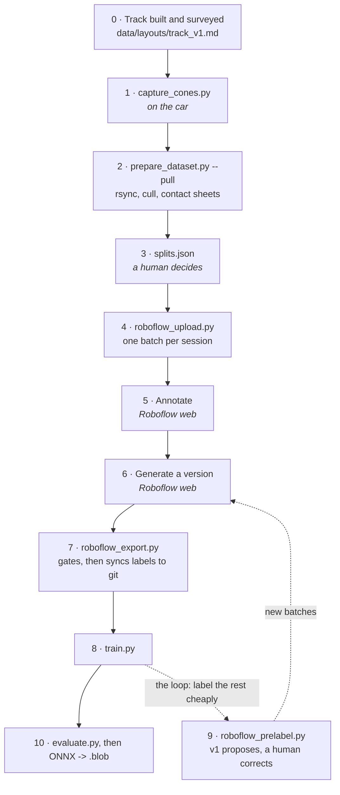

# CV Model Development

Everything about the cone detector that happens **off-car**. The on-car runtime
is `model/capture/drive_junction.py` plus the pure packages in `src/`.

## Layout

```
capture/     On-car tools: gamepad-triggered OAK-D recorder, the lidar, depth and
             detector live views (see its README)
cone_classes.py  Class order, parsed from LabeledCone.msg, and the checks against it
runtime.py       Device selection and run provenance, shared by the scripts below
dataset/
  images/    NOT in git (gitignored). Canonical copy lives in the team's
             shared Drive / Roboflow project — link it here once it exists.
  labels/    YOLO labels, data.yaml and manifest.json from the last export. IN git.
  export/    Downloaded Roboflow exports. NOT in git; re-download them.
  prepare_dataset.py     Pull sessions off the car, dedupe, cull, contact-sheet
  splits.json            Which session goes to which split — the split lives here
  roboflow_upload.py     Upload sessions as batches, one split per session
  roboflow_prelabel.py   Propose boxes with v1 for correction (model-assisted step)
  roboflow_export.py     Download a version, check it, sync labels into git
  LABELING.md            Roboflow setup, box protocol, augmentation, training, export
  DATASET_CARD.md
training/    train.py, evaluate.py, and one directory per run (D2 curves)
export/      .pt -> ONNX -> OAK-D .blob conversion scripts
```

`capture/` runs on the Pi but produces a dataset, so it lives here with the rest
of D1 rather than under `src/`. It deliberately does not use ROS: the dataset is
an off-car deliverable, and rosbag round-tripping would add a lossy re-encode
for no benefit. Its DepthAI pipeline is the reference camera configuration that
the on-car detector mirrors at inference time — if capture and inference
disagree on white balance, the detector sees different colors than it trained
on.

## Off-car environment

Everything here except `capture/` runs on a laptop, against a venv in `model/.venv`
(gitignored):

```bash
cd model
/path/to/python3.11-or-newer -m venv .venv   # NOT bare `python3` on macOS — see below
source .venv/bin/activate
pip install -r requirements.txt
```

**Python 3.11 is a hard floor** (numpy 2.3.5). macOS ships 3.9 as `python3` and
it wins the PATH even inside a conda `(base)` shell; the resulting venv fails
with `Could not find a version that satisfies the requirement roboflow==1.4.1`,
which looks like a wrong pin and is actually a pip too old to read the release
metadata. Verify with `python -V` after activating, before believing any
install error. The car runs 3.11.2; this machine's miniforge is 3.13.

`capture/` is the exception — it runs on the car against `~/env` and deliberately
depends on nothing that is not already there.

## Classes

| id | class   | role                                         |
|----|---------|----------------------------------------------|
| 0  | blue    | left corridor boundary                       |
| 1  | magenta | goal marker                                  |
| 2  | orange  | dead end — the wall across a stub            |
| 3  | red     | junction gate — always placed in pairs       |
| 4  | yellow  | right corridor boundary                      |

The ids are alphabetical by name — the order Roboflow assigns. They carry no
meaning beyond agreeing with the dataset; see the note in `LabeledCone.msg`.

The class *is* the color; left/right are relative to the direction of travel, so
the same corridor driven in reverse still has blue on its own left. Class ids
must match `cone_msgs/msg/LabeledCone.msg` — that file is the source of truth,
and the Roboflow project's class order must be verified against it in the
exported `data.yaml` rather than assumed.

Because color carries the class, **never augment with hue or saturation jitter**
— it teaches the model that blue and yellow are interchangeable.

**Red and orange are the pair that matters.** They are the two most similar
colors on the track and they mean opposite things: a dead end read as a gate
hands the car off to `junction_exec` at a wall, and a gate read as a dead end
misses the junction. Report their per-class numbers separately and look at the
confusion between them specifically — `evaluate.py` calls that pair out by name.

## Pipeline

Car to weights, and what each stage guarantees. Steps 1-2 happen once per capture
day; 4-8 are a loop that tightens as the model gets good enough to label for you.



| # | What runs | Produces | What it is there for |
|---|---|---|---|
| 0 | — | `track_v1.csv` survey | Capture on the course we actually intend to run |
| 1 | `capture/capture_cones.py` | `~/cone_capture/<session>/frames/` + `session.json` | One **session** = one set of conditions. Locked AE/AWB/focus, recorded |
| 2 | `dataset/prepare_dataset.py --pull robocar` | `dataset/images/<session>/`, `_rejected/`, contact sheets | Drops blurry (VoL < 40) and near-duplicate (dHash <= 6) frames. **Moves**, never deletes |
| 3 | edit `dataset/splits.json` | session -> train/valid/test | Split by whole session. A random split puts near-identical frames on both sides and inflates mAP |
| 4 | `dataset/roboflow_upload.py` | Roboflow batches | Split assigned at upload; frames renamed `<session>__<frame>.jpg`. `--limit` samples evenly for a hand-label batch |
| 5 | Roboflow web | annotations | Box protocol in [`dataset/LABELING.md`](dataset/LABELING.md) |
| 6 | Roboflow web | a numbered **version** | The immutable snapshot a training run cites. Augmentation multiplies train images only |
| 7 | `dataset/roboflow_export.py --version N` | `dataset/export/` (gitignored), `dataset/labels/` (**in git**) | Refuses unless the class order matches the `.msg` and no session straddles two splits |
| 8 | `training/train.py --data .../data.yaml` | `training/<name>/` weights + curves | Curves are D2. Colour-unsafe augmentation is not reachable from the CLI |
| 9 | `dataset/roboflow_prelabel.py --weights .../best.pt` | `<session>-auto` batches, tagged | v1 proposes boxes on the frames nobody labeled; correcting is far faster than drawing |
| 10 | `training/evaluate.py --split test`, then `export/` | per-class numbers, OAK-D `.blob` | Report red-vs-orange separately; weights attach to a Release, not to git |
| 11 | `capture/detect_view.py --weights best.pt` | a live view of the boxes | The deployment check: right colour box on right cone, on this camera, in this light |

### Two rules that explain the rest of it

**The session is the unit of everything** — the split, the Roboflow batch, the
filename prefix, the provenance row in `DATASET_CARD.md`. That is what turns "did
anything leak across the split?" into a question `roboflow_export.py` can answer
instead of something you hope about.

**Images are never in git; labels always are.** `dataset/export/` is disposable —
re-download it with the script. `dataset/labels/` and its `manifest.json` are the
committed record of exactly what a model was trained on. Roboflow is the canonical
image store, which is also the answer to sharing the dataset across machines.

### Numbers that change on their own, and why

Frame counts drop at step 2 (the cull) and **rise** at step 6: Roboflow's
augmentation multiplies the training split only, so 107 uploaded train images can
export as ~320 while valid and test stay exactly as uploaded. Neither is a bug.
The counts to quote in `DATASET_CARD.md` are the ones `roboflow_export.py` prints,
because those describe the dataset the model actually saw.
